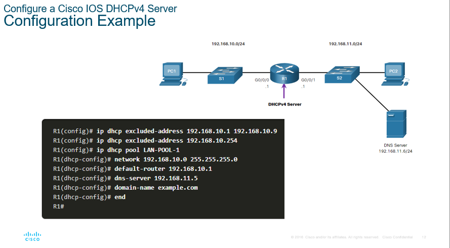
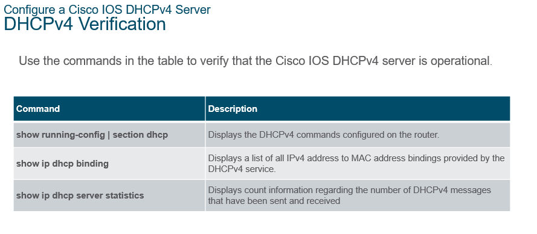

### ***TROUBLESHOOT DHCPv4 CONFIGURATION***

### ***ROUTER AS DHCP SERVER***
- ip dhcp excluded-address
- ip dhcp pool <pool_name>

### ***EXAMPLE***
- ip dhcp excluded-address 192.168.10.1 192.168.10.20
- ip dhcp pool LAN_1
- network 192.168.10.0, 255.255.255.0
- default-router 192.168.10.1

Configure the interface and define the address you want help

- ip helper-addres < dhcp server address >
 
### ***TROUBLESHOOT DHCPv4 CONFIGURATION***
