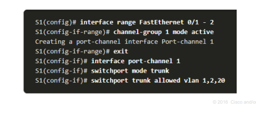
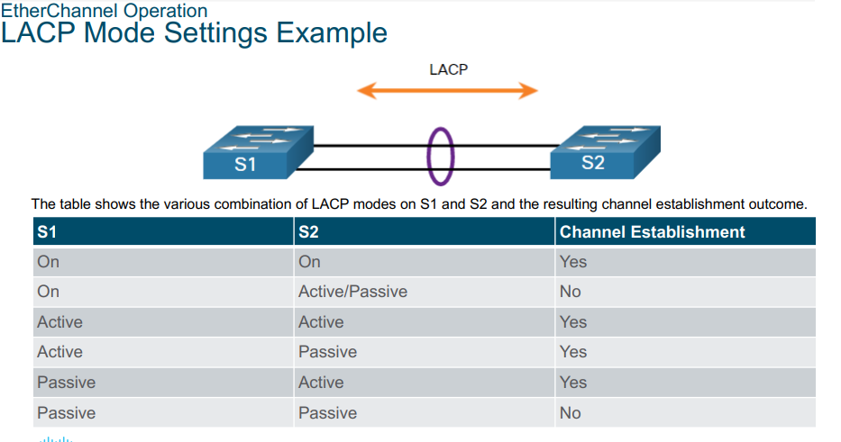
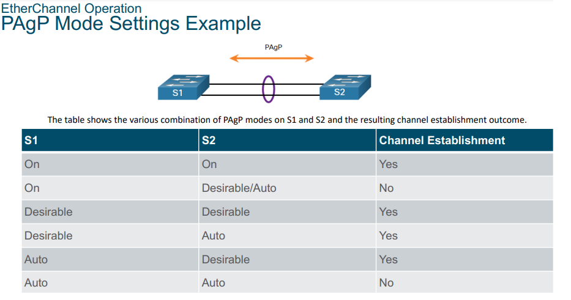

### ***ETHERCHANNEL CONFIGURATION***

### ***LACP MODE SETTING***

### ***PAGP MODE SETTING***

### ***TROUBLESHOOT ETHERCHANNEL CONFIGURATION***
- show interfaces port-channel
- show interfaces etherchannel
- show etherchannel summary
- show etherchannel port-channel 
- show run | begin interface port-channel